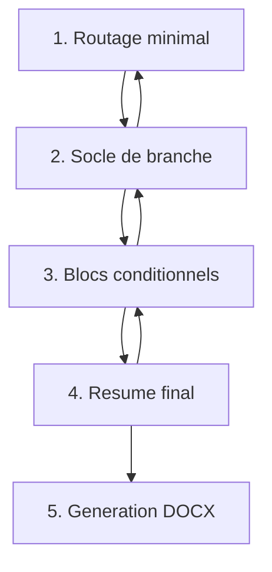

# UI flow V1 - Parcours dossier-centre

Ticket : `UI-FLOW-001`

Date : 2026-05-17

## Objet

Ce document formalise le parcours UI V1 attendu pour piloter une generation
de dossier avec le moteur documentaire existant.

Le parcours est **dossier-centre**, pas document-centre :

- l'utilisateur ne remplit jamais un document unitairement ;
- l'UI collecte un contexte dossier canonique ;
- la selection documentaire reste calculee par le catalogue et
  l'orchestrateur ;
- la generation produit les DOCX du dossier selectionne.

Ce ticket est une specification UI. Il ne modifie pas le code Python, ne vaut
pas validation juridique et ne modifie aucun fichier de pilotage partage.

## References

- `AGENTS.md`
- `docs/project/00_MASTER_PLAN.md`
- `docs/project/07_ARBRE_MOTEUR_DOCUMENT_CENTRE_V1.md`
- `docs/project/08_DICTIONNAIRE_VARIABLES_CANONIQUES_V1.md`
- `docs/project/09_TABLE_MAPPING_DOCUMENTS_VARIABLES_V1.md`
- `docs/project/16_MOTOR_COMPLETION_AUDIT_V1.md`
- `docs/project/18_NEXT_PHASE_FOUNDATION_V1.md`
- ADR-0001 : source de verite documentaire
- ADR-0002 : moteur construit par document canonique
- ADR-0005 : mode operatoire GitHub + Codex

## Principes de parcours

1. Demander d'abord uniquement ce qui sert a choisir la branche dossier.
2. Afficher ensuite le socle commun de cette branche.
3. Afficher les blocs conditionnels seulement quand leur condition parente est
   vraie.
4. Presenter un resume final avant toute generation.
5. Declencher la generation via l'orchestrateur dossier, jamais document par
   document.

## Etapes du flow

### 1. Routage minimal

Objectif : identifier la branche documentaire sans demander de champs inutiles.

| Champ UI | Variable cible | Obligatoire | Role |
|---|---|---:|---|
| Structure du dossier | `dossier.structure` / runtime `structure` | oui | Choisit la branche principale. |

Valeurs autorisees :

- `SELARL`
- `SELAS`
- `SPFPL cession`
- `SPFPL apport`
- `SCS`
- `SCI`
- `SCI IRIS`
- `SCM`
- `SAS`

Regle : aucun champ de cession, regime communautaire, derogation, SCM, SPFPL,
statuts ou generation ne doit etre demande avant ce choix.

### 2. Socle de branche

Objectif : demander les champs communs aux documents de la branche choisie.

Le socle est compose d'un socle transversal et d'un socle propre a la branche.

#### Socle transversal tous dossiers

| Pack | Champs attendus V1 |
|---|---|
| `personne_signataire` | `genre`, `civilite`, `prenom`, `nom`, adresse personnelle et donnees de naissance si requises par les documents selectionnes. |
| `signature` | `lieu`, `date`, `nombre_exemplaires` ou `prestataire_signature_electronique` seulement si un document selectionne les requiert. |
| `societe` ou `societe_spfpl` | denomination, forme, capital, siege, ville RCS selon la branche. |
| `domiciliation` | adresse affichee de domiciliation pour les documents universels ; le nom canonique documentaire reste `domiciliation.adresse_affichee`, avec alias runtime legacy connu `adresse_domiciliation_affichee`. |

#### Socle par branche

| Branche | Champs du socle de branche |
|---|---|
| `SAS` | `dossier_options.associe_unique`, `statuts_sas.type`, `statuts_sas.profession`, `societe_spfpl`, `actionnaire_unique`, `president`, `depot_fonds`, `exercice_social`, `capital_souscription`. |
| `SELARL` | `statuts_sel.overlay`, `statuts_sel.profession`, `societe`, `associes[]`, `dirigeant_nomine`, `decision`, `reunion`, `capital`, `apport`, `depot_fonds`, `exercice_social`, `ordre`, `mandataire`. |
| `SELAS` | `statuts_sel.overlay`, `statuts_sel.profession`, `societe`, `associes[]`, `dirigeant_nomine`, `decision`, `reunion`, `capital`, `apport`, `depot_fonds`, `exercice_social`, `ordre`, `mandataire`. |
| `SPFPL cession` | `dossier_options.cession`, `dossier_options.associe_unique`, `operation_spfpl.type`, `societe_spfpl`, `actionnaire_unique`, `societe_cible`, `cedant`, `associes_cible[]`, `capital_souscription`, `depot_fonds`, `exercice_social`, `ordre`, `mandataire`. |
| `SPFPL apport` | `dossier_options.apport`, `operation_spfpl.type`, `societe_spfpl`, `actionnaire_unique`, `societe_cible`, `apporteur`, `apport`, `apport_titres`, `capital_souscription`, `commissaire_aux_apports`, `evaluateur_apport`, `ordre`, `mandataire`. |
| `SCS` | `societe`, `associes[]`, `dirigeant_nomine`, `decision`, `reunion`, `capital`, `statuts_civils.type`, `statuts_civils.associes[]`, `statuts_civils.capital_depot`. |
| `SCI` | `societe`, `associes[]`, `dirigeant_nomine`, `decision`, `reunion`, `capital`, `statuts_civils.type`, `statuts_civils.associes[]`, `statuts_civils.capital_depot`. |
| `SCI IRIS` | `societe`, `associes[]`, `dirigeant_nomine`, `decision`, `reunion`, `capital`, `statuts_civils.type`, `statuts_civils.associes[]`, `statuts_civils.resultat_groupes_parts[]`, `statuts_civils.capital_depot`. |
| `SCM` | `societe`, `associes[]`, `dirigeant_nomine`, `decision`, `reunion`, `capital`, `ordre`, `mandataire`, `statuts_civils.type`, `statuts_civils.associes[]`, `statuts_civils.capital_depot`. |

Regles :

- les champs du socle sont affiches comme des blocs metier, pas comme une liste
  de documents ;
- une meme donnee saisie une fois alimente tous les documents qui en dependent ;
- les blocs `associes[]` et `statuts_civils.associes[]` doivent rester
  distincts cote donnees tant qu'ils ne sont pas unifies par un ticket dedie ;
- les champs qui ne servent qu'a un bloc conditionnel restent caches a cette
  etape.

### 3. Blocs conditionnels

Objectif : afficher les blocs specifiques seulement apres le socle de branche
et seulement si leurs conditions sont reunies.

| Bloc conditionnel | Condition d'affichage | Champs affiches | Documents concernes |
|---|---|---|---|
| Emprunt PV | Branche hors `SAS` avec `emprunt.actif == true` | `emprunt.montant_max`, `bien_immobilier.adresse.*` | `DOC-004` |
| Regime communautaire | Structure dans `SELARL`, `SELAS`, `SPFPL cession`, `SPFPL apport` et `dossier_options.regime_communautaire == true` | `conjoint`, `apport`, `regime_communautaire.renonciation`, `regime_communautaire.avertissement` | `DOC-005`, `DOC-006` |
| Cession cabinet / bail | Structure dans `SELARL`, `SELAS` et `dossier_options.cession == true` | `cession.type_cabinet`, `cession.etape`, `cession.vendeur`, `cession.acquereur`, `cession.cabinet`, `cession.prix`, `cession.financement`, `bail` | `DOC-007` a `DOC-012` |
| Appel de fonds SEL | `SELARL`, cession active, `cession.type_cabinet == dentaire` | `cession.financement`, `cession.vendeur`, `cession.acquereur` | `DOC-008` |
| Derogations | Structure dans `SELARL`, `SELAS` et `dossier_options.derogation == true` | `derogation.type`, `derogation.mode_rendu`, roles, sites, cumul, motifs, conditions | `DOC-013`, `DOC-014` selon type |
| Option IS | Structure dans `SCI`, `SCI IRIS` et `dossier_options.option_is == true` | `impots`, donnees de signature et coherence `statuts_civils.type` | `DOC-022` |
| Satellites SAS | `SAS`, `dossier_options.associe_unique == true`, statuts SAS compatibles | `remuneration_president`, `capital_souscription`, `apport_titres`, `societe_cible` | `DOC-023`, `DOC-024` |
| SPFPL cession | `SPFPL cession`, `dossier_options.cession == true`, `operation_spfpl.type == cession` | `cession_parts` ou `cession_actions`, `associes_cible[]`, `document`, `decision`, `reunion` | `DOC-037` a `DOC-040`, `DOC-029` |
| SPFPL apport | `SPFPL apport`, `dossier_options.apport == true`, `operation_spfpl.type == apport` | `apport_titres`, `capital_souscription`, `evaluateur_apport`, `commissaire_aux_apports`, `document` | `DOC-037`, `DOC-041` a `DOC-043` |
| Satellites SCM | `SCM` et `dossier_options.scm_satellites == true` | `scm_satellites.*`, `parties_frais_communs[]`, `praticiens[]`, `locaux`, `pacte_associes`, `frais_communs`, `reglement_interieur` | `DOC-026` a `DOC-028`, `DOC-030` |
| Cession SCM | Structure dans `SELARL`, `SELAS` et `dossier_options.scm_cession == true` | `scm_cession`, `scm_cession.scm_cedee`, `scm_cession.cessionnaire`, `scm_cession.cedant`, `scm_cession.prix`, `scm_cession.enregistrement` | `DOC-031` a `DOC-033` |

Regles de sous-selection :

- `cession.etape == acte` selectionne l'acte ; `cession.etape == compromis`
  selectionne le compromis.
- `cession.type_cabinet == medical` selectionne les documents medicaux ;
  `cession.type_cabinet == dentaire` selectionne les documents dentaires.
- `derogation.type == multi_sites_sel` vise `DOC-013`.
- `derogation.type == cumul_sel_bnc` vise `DOC-014` et reste limite a
  `SELARL`.
- `operation_spfpl.nature_titres == actions` avec
  `operation_spfpl.document_demande == acte_cession_actions` vise `DOC-029`.
- dans les autres cas de SPFPL cession portant sur des parts, le flux vise
  `DOC-040`.
- `dossier_options.associe_unique == true` vise le PV d'agrement associe
  unique ; `false` vise la variante plusieurs associes.

### 4. Resume final

Le resume final doit apparaitre avant toute generation.

Il affiche :

- la branche choisie ;
- les blocs actifs et inactifs ;
- les champs obligatoires manquants, groupes par bloc metier ;
- les documents que l'orchestrateur selectionnera ;
- les documents exclus parce que leurs conditions sont fausses ;
- les documents manuels ou legacy hors automatisation V1 ;
- le dossier de sortie cible ;
- un avertissement explicite : la generation ne vaut pas validation juridique
  ni validation visuelle humaine.

Le resume ne doit pas transformer l'UI en saisie document par document. La liste
des documents sert a controler la selection, pas a ouvrir des formulaires
independants.

### 5. Declenchement de generation

Le bouton de generation est visible uniquement sur le resume final.

Au clic :

1. construire un `DocumentGenerationContext` a partir des blocs visibles et
   valides ;
2. appeler `select_documents_for_context(ctx)` pour confirmer la selection ;
3. bloquer la generation si aucun document n'est selectionne ou si une erreur
   de validation moteur est presente ;
4. appeler `generate_documents(ctx, output_dir)` ;
5. afficher les chemins des DOCX produits et les erreurs document par document
   si l'orchestrateur en remonte.

La V1 de ce flow declenche la generation DOCX. PDF et ZIP restent des etapes
posterieures a brancher par tickets dedies.

## Regles d'affichage conditionnel

1. Un bloc n'est visible que si sa branche parente est visible.
2. Une option sensible est `false` par defaut sauf si un contexte charge la
   fournit explicitement.
3. Les champs d'un bloc conditionnel restent absents du formulaire tant que la
   condition d'affichage du bloc est fausse.
4. Les validateurs obligatoires s'appliquent uniquement aux champs visibles ou
   aux champs requis par les documents effectivement selectionnes.
5. Quand un discriminant change, les sous-blocs dependants sont recalcules
   immediatement.
6. Les documents a remplir a la main ou legacy non convertis sont presentes
   comme exclus ou manuels, jamais comme formulaires automatises.
7. L'UI ne doit pas deduire une regle juridique nouvelle pour rendre un bloc
   affichable ; en cas d'ambiguite, elle doit afficher un blocage metier.
8. La liste des documents selectionnes provient de l'orchestrateur, pas d'une
   duplication de logique dans l'UI.

## Regles de navigation avant / arriere

### Suivant

- Le passage a l'etape suivante est bloque si un champ obligatoire visible est
  invalide.
- Le passage de `Routage minimal` vers `Socle de branche` initialise le socle
  de la branche selectionnee.
- Le passage de `Socle de branche` vers `Blocs conditionnels` active seulement
  les options compatibles avec la branche.
- Le passage vers `Resume final` recalcule la selection via l'orchestrateur.

### Retour

- Le retour est toujours possible jusqu'au routage.
- Les champs transversaux deja saisis sont conserves.
- Si `dossier.structure` change, les champs de branche et les blocs
  conditionnels incompatibles sont retires du contexte de generation.
- Les donnees retirees peuvent rester dans un brouillon UI local, mais elles ne
  doivent pas etre envoyees a l'orchestrateur tant que leur branche n'est pas
  active.
- Apres tout retour modifiant un discriminant, le resume final precedent est
  invalide et doit etre regenere.

### Edition depuis le resume

- Chaque bloc du resume renvoie vers son etape metier : routage, socle ou bloc
  conditionnel.
- Apres correction, l'utilisateur revient au resume recalculé.
- Aucun bouton de generation ne doit rester actif apres modification d'une
  donnee visible.

## Structure retenue

La structure retenue pour UI V1 est :

1. `Routage minimal`
2. `Socle de branche`
3. `Blocs conditionnels`
4. `Resume final`
5. `Generation DOCX`

Ce flow respecte l'architecture document-canonique : l'UI est centree sur le
dossier, mais la selection finale reste deleguee au moteur document-centre.

## Hors perimetre UI-FLOW-001

- implementation Streamlit ;
- modification du catalogue, de l'orchestrateur ou des modeles Python ;
- PDF ;
- ZIP ;
- recette finale ;
- mise a jour des fichiers de pilotage partages ;
- modification de wording juridique.
